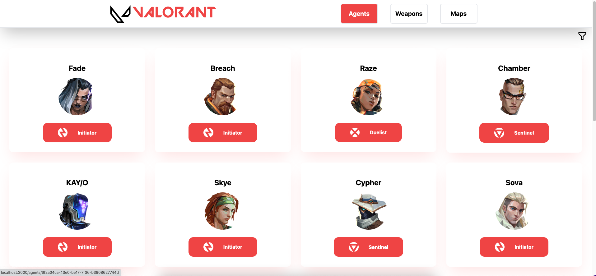
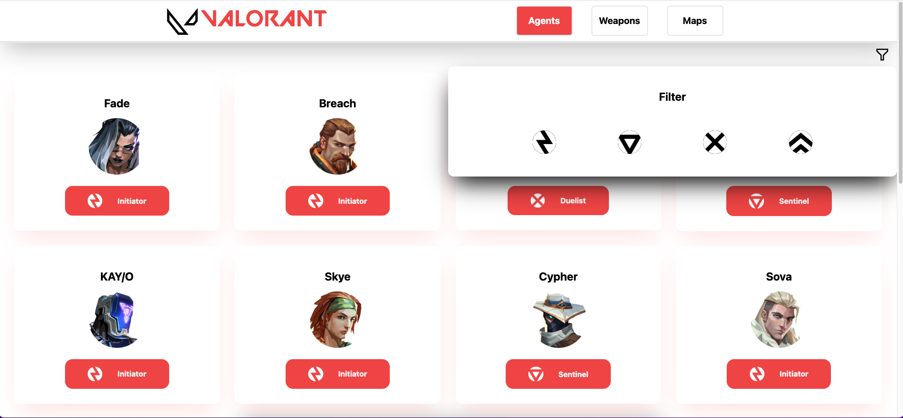
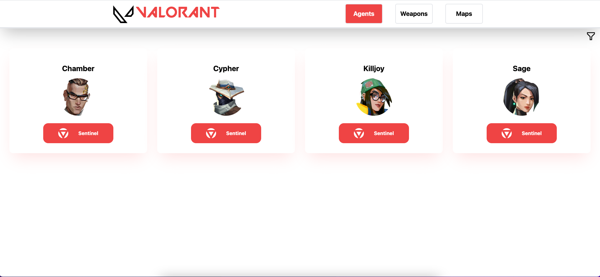
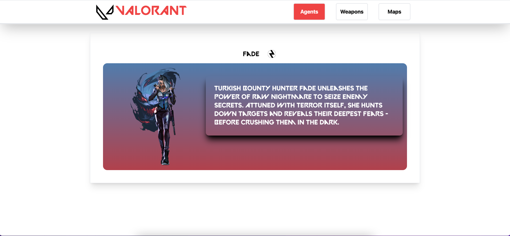
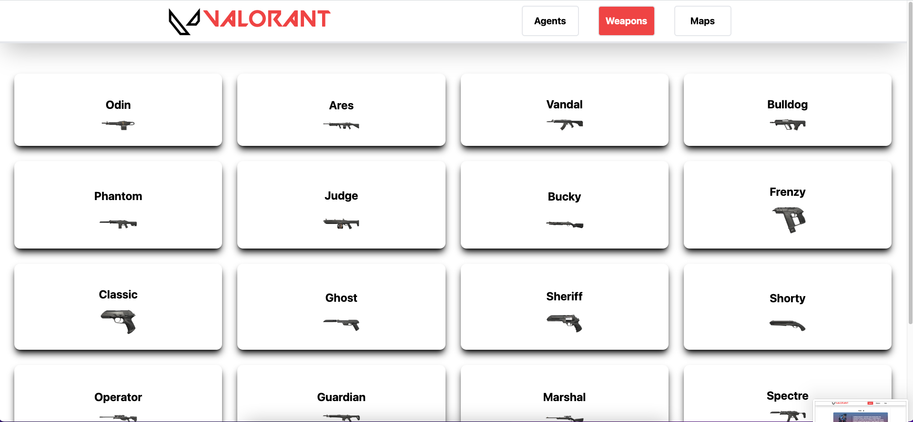
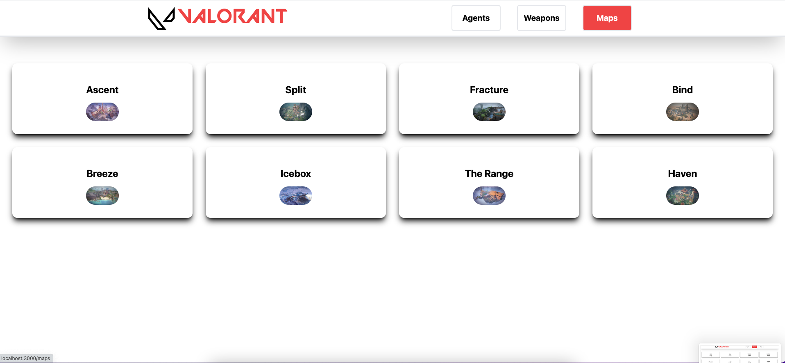

<h1 align="center">
  :zap: Valorant Wiki :zap:
</h1>
<h2>
  About :grey_question:
</h2>

  This is an app that shows users details about Valorant Agents, weapons and maps.
     
  <strong><em>Here is the live version:</em></strong>https://typing-speed-4un.pages.dev/

<h2>
  Flow :ocean:
</h2>

  When you start the app it welcomes you with fetched agents from the API. The user can filter the agents or go into their detail page by clicking on the card. There are 4 types of agents and user can filter them by clicking their icons on filter tab. In the header there are two buttons named "Weapons" and "Maps" and the user can go to their page. In Agent Detail page if the user clicks on agents name his/her voiceline kicks in.

<h2>a
  Stack :rocket:
</h2
 <ul>
      <li>React</li>
      <li>Typescript</li>
      <li>Tailwind</li>
      <li>Hooks</li>
      <li>React Router</li>
      <li>Redux Toolkit</li>
      <li>Axios</li>
</ul>
  
<h2>
  Screenshots :camera_flash:
</h2>

<h3>
  Main Screen
</h3>

<h3>
  Main Screen with Filter
</h3>

<h3>
  Filtered Agents
</h3>

<h3>
  Selected Agent
</h3>

<h3>
  Weapons
</h3>

<h3>
  Maps
</h3>

 

 
